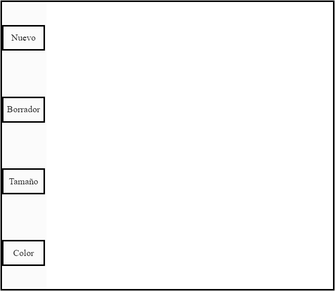

# Ciu práctica 8
p5.js
## Autor 
**Doramas Báez Bernal**  
Correo: doramas.baez101@alu.ulpgc.es

## Gif

  
  

    Figura 1: interfaz de la aplicacion
  

## Índice
* [Introducción](#introducción)
* [Dependencias](#dependencias) 
* [Desarrollo](#desarrollo)
    * [Información general](#informaciónGeneral)
* [Referencias](#referencias)

## Introducción
El objetivo de esta práctica es realizar una aplicación similar al paint, es decir, el usuario debe poder pintar sobre un lienzo y como requisito mínimo se pide poder cambiar el color y el grosor del trazo. Además, la idea es familiarizarnos con la librearia de javaScript p5.js.

## Dependencias
Realmente no existen dependencias como tal, pero es necesario, poder utilizar el navegador o cualquier programa capaz de ejecutar html.
 

## Desarrollo

### Información general 

Básicamente se ha realizado la asignación de una tecla a una nota (notación inglesa): 
 - Q key: Se corresponde con C3
 - W key: Se corresponde con D3
 - E key: Se corresponde con E3 
 - R key: Se corresponde con F3
 - T key: Se corresponde con G3
 - Y key: Se corresponde con A3
 - U key: Se corresponde con B3
 - I key: Se corresponde con C4
 

## Referencias

* [Guion de prácticas](https://cv-aep.ulpgc.es/cv/ulpgctp20/pluginfile.php/126724/mod_resource/content/22/CIU_Pr_cticas.pdf)
* [editorP5JS](https://editor.p5js.org/)
